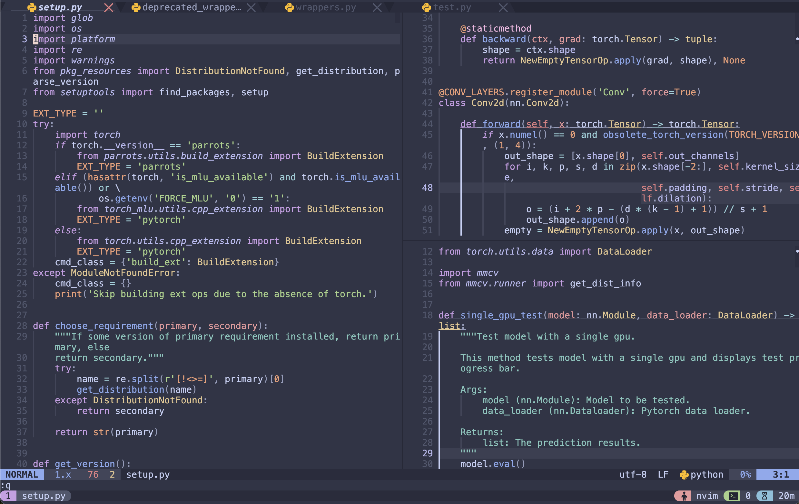

# Demo



# Requirements:

* kitti
* neovim
* tmux
* zsh (Optional)

## Download and install NeoVIM

> **Note:** Current NVIM version is v0.11.1

[Download link](https://github.com/neovim/neovim/releases)

```
ln -s /your/path/to/dotfiles/nvim-config ~/.config/nvim/
```

## Download and install TMUX 

[Download link](https://github.com/tmux/tmux/wiki)

### Download tmux plugins manager (TPM):

```
git clone https://github.com/tmux-plugins/tpm ~/.tmux/plugins/tpm
```

```
ln -s /your/path/to/dotfiles/tmux/tmux.conf ~/.tmux.conf
```

or 

```
ln -s /your/path/to/dotfiles/tmux/tmux.conf $XDG_CONFIG_HOME/tmux/tmux.conf
```

### Install tmux plugins:

1. Press prefix + I (capital i, as in Install) to fetch the plugin.
2. tmux source ~/.tmux.conf

## Download and install ZSH and Oh my zsh

> **Note:** We must backup .zshrc file before installing oh-my-zsh. Because oh-my-zsh will overwrite the current one.

[Checkout this link](https://gist.github.com/n1snt/454b879b8f0b7995740ae04c5fb5b7df)

## Download and install KITTY

> **Note:** We can use **Binary install** and remember to set **Desktop integration on Linux**

[Checkout this link](https://sw.kovidgoyal.net/kitty/binary/)

## Download and install NPM to install `pyright`

[Checkout this link](https://nodejs.org/en/download/)

## Download fzf

[Checkout this link](https://github.com/junegunn/fzf)

### Current theme

1. Kitti terminal: Catppuccin-Frappe

```
kitty +kitten themes --reload-in=all Catppuccin-Frappe
```

2. Nvim: Catppuccin-Frappe
3. Tmux: Catppuccin-Frappe
4. Buffer line: Catppuccin-Frappe

# References

* [Tmux plugins manager](https://github.com/tmux-plugins/tpm)

* [Kitty](https://sw.kovidgoyal.net/kitty/)

* [NodeJS](https://nodejs.org/en)

* [Lazygit](https://github.com/jesseduffield/lazygit)
